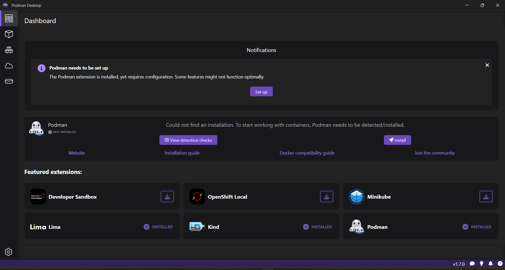
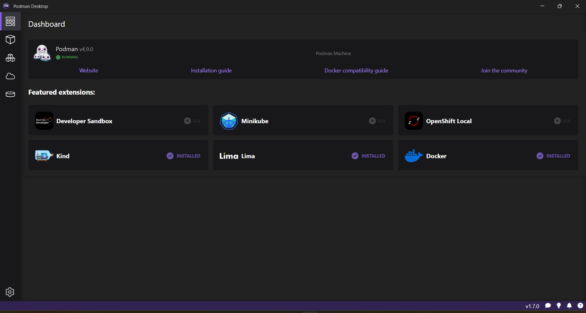

# Installing Podman Desktop and Podman on Windows

## Installing Podman Desktop

To install Podman Desktop:

1. [Download the Windows installer](/downloads/windows).

1. To start the Podman Desktop installer, open the downloaded file.

   

<details>
<summary>
Alternate installation methods:
- Silent Windows installer
- Chocolatey
- Scoop
- Winget
</summary>

#### Silent Windows installer

1. [Download the Windows installer](/downloads/windows).

1. To install without user interaction, run the Windows installer with the silent flag `/S` from the Command Prompt:

   ```shell-session
   > podman-desktop-1.6.4-setup-x64.exe /S
   ```

#### Chocolatey

1. Install the [Chocolatey package manager](https://chocolatey.org/install).

1. Install from the terminal:

   ```shell-session
   > choco install podman-desktop
   ```

#### Scoop package manager for Windows

1. [Install the Scoop package manager](https://github.com/ScoopInstaller/Install#readme).

1. Install from the terminal:

   ```shell-session
   > scoop bucket add extras
   > scoop install podman-desktop
   ```

#### Winget

1. [Install the Winget Package manager for Windows](https://aka.ms/getwinget).

1. Install from the terminal:

   ```shell-session
   > winget install -e --id RedHat.Podman-Desktop
   ```

</details>

## Installing Podman

On Windows, running the Podman container engine requires running a Linux distribution on a virtual machine.

### Use WSL2 as machine provider

Podman Desktop creates a [Windows Subsystem for Linux version 2 (WSL 2)](https://learn.microsoft.com/en-us/windows/wsl/about#what-is-wsl-2) virtual machine: the Podman Machine.

Main benefits are:

- Ease of use.
- WSL 2 native virtualization performance.

Check that your environment has:

- 6 GB RAM for the Podman Machine.
- Windows Subsystem for Linux version 2 (WSL 2) prerequisites. See [Enabling WSL 2](https://docs.microsoft.com/en-us/windows/wsl/install), [WSL basic commands](https://learn.microsoft.com/en-us/windows/wsl/basic-commands), and [Troubleshooting WSL 2](https://learn.microsoft.com/en-us/windows/wsl/troubleshooting#error-0x80370102-the-virtual-machine-could-not-be-started-because-a-required-feature-is-not-installed):
  - The Windows user has administrator privileges.
  - Windows 64bit.
  - Windows 10 Build 19043 or greater, or Windows 11.
  - On a virtual machine: [Nested Virtualization enabled](https://learn.microsoft.com/en-us/virtualization/hyper-v-on-windows/user-guide/nested-virtualization#configure-nested-virtualization).

To install the Podman Machine:

1. To prepare your system, enable the WSL feature, without installing the default Ubuntu distribution of Linux.

   Open the Command Prompt, and run:.

   ```shell-session
   > wsl --update
   > wsl --install --no-distribution
   ```
   :::note

   If you run the Podman Desktop setup on a Windows 10 LTSC version, you require to install a specific WSL distribution. See [Troubleshooting Podman on Windows](/docs/troubleshooting/troubleshooting-podman-on-windows#windows-10-enterprise-ltsc-version-21h2-podman-desktop-is-unable-to-detect-wsl2-machine)

   :::

1. Restart your computer.

1. The **Dashboard** screen displays: _<Icon icon="fa-solid fa-info" size="lg" /> Podman needs to be set up_.

   

1. Click the **Set up** button.

1. Review and validate all confirmation screens to set up the Podman machine.

1. When necessary, follow the instructions to install system prerequisites.

To verify that Podman is set up:

- In the **Dashboard**, the **Podman** tile displays _Podman is running_.

  

### Use Hyper-V as machine provider

Before creating a Podman machine, you can use one of the following ways to enable it to use Hyper-V:

**_Configuring an environment variable_**

1. Perform one of the following steps:
   - As a normal user, set the following variable at session level:

      ```shell-session
      > $env:CONTAINERS_MACHINE_PROVIDER = 'hyperv'
      ```
   - As an admin user, set the following variable at system level:

      ```shell-session
      # [System.Environment]::SetEnvironmentVariable('CONTAINERS_MACHINE_PROVIDER','hyperv')
      ```

1. [Create and start a Podman machine](/docs/podman/creating-a-podman-machine) using the UI.

**_Configuring the `containers.conf` file_**

1. Open the `containers.conf` file on your machine. The file is usually placed at `C:\Users\myuser\AppData\Roaming\containers\`. 
1. Add the `provider` attribute and set its value to `hyperv` in the file.

   ```vim
   ...
   [machine]

   provider = "hyperv"
   ...
   ```

1. [Create and start a Podman machine](/docs/podman/creating-a-podman-machine) using the UI.  

#### Verification
After configuration, you can confirm whether you are using a Podman machine with Hyper-V virtualization provider.

1. Go to **Settings > Resources**.
1. Click the **Podman details** icon in the Podman tile.
1. Select the **Logs** tab to view the following notification message:

   ```
   time="2023-05-09T21:16:08+03:00" level=debug msg="Using Podman machine with `hyperv` virtualization provider"
   ```

#### Next steps

- [Work with containers](/docs/containers).
- [Work with Kubernetes](/docs/kubernetes).
