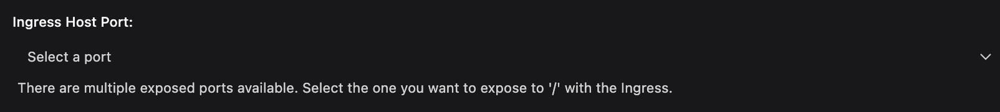

# Deploying a pod or container to Kubernetes

With Podman Desktop, you can deploy a pod to your Kubernetes cluster with an active connection. Any container that is part of a pod is also deployable to your cluster.

#### Prerequisites

- Your are using the Podman container engine.
- Your pod, running or stopped, is available on the **Pods** page: _&lt;your_pod&gt;_.
- You registered the Kubernetes cluster in your kubeconfig file: _&lt;your_kubernetes_cluster&gt;_. For example, [Creating a kind cluster](/docs/kind/creating-a-kind-cluster).
- The Kubernetes namespace to deploy to already exists.
- Your container has a port that is exposed correctly to generate a service.

#### Procedure

1. Select your [Kubernetes context](/docs/kubernetes/viewing-and-selecting-current-kubernetes-context). 

    :::note

    Your pod or container is deployed to the `default` namespace of the Kubernetes cluster. To switch to a different namespace, use this command: `kubectl config set-context --current --namespace=<name-of-the-namespace>`. 

    :::

1. Go to the **Pods** or **Containers** component page.
1. Click the overflow menu icon corresponding to the pod or container.
  
1. Select the **Deploy to Kubernetes** option from the dropdown list.
1. Select the checkbox to expose the service locally by using the default ingress controller.
  
1. Conditional: When you configure custom port mapping while running an image, you have the option to select an Ingress host port from the dropdown list. 
  
  Otherwise, you do not see the option. 

1. Click **Deploy** and then **Done**.

#### Verification

1. On the **Deploy generated pod to Kubernetes** screen, the created pod status is _Phase: Running_
  

1. Go to **Pods**: your Kubernetes pod is in the list.
  

1. Optional: Check the running service on the **Kubernetes > Services** page.
    