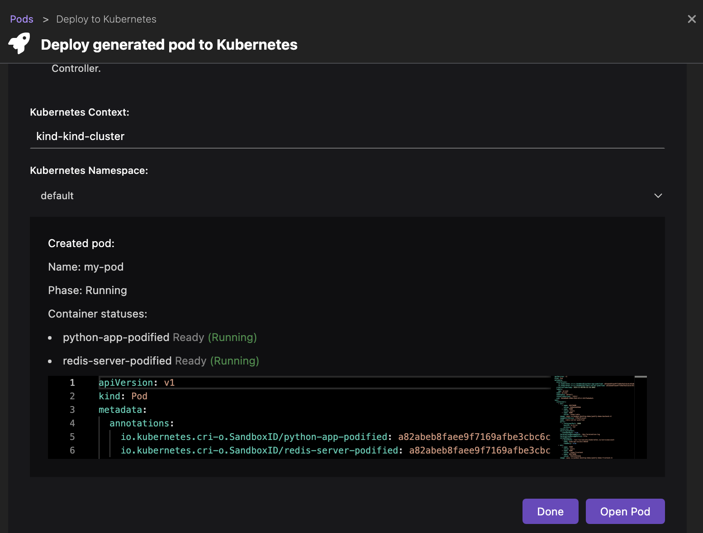

# Deploying a pod to Kubernetes

With Podman Desktop, you can deploy a pod to your Kubernetes cluster.

#### Prerequisites

- Your are using the Podman container engine.
- Your pod, running or stopped, is available on the **Pods** page: _&lt;your_pod&gt;_.
- You registered the Kubernetes cluster in your kubeconfig file: _&lt;your_kubernetes_cluster&gt;_. For example, [Creating a kind cluster](/docs/kind/creating-a-kind-cluster).
- The Kubernetes namespace to deploy to already exists.

#### Procedure

1. Click **Podman Desktop tray > Kubernetes > Context > _&lt;your_kubernetes_cluster&gt;_** to set your Kubernetes context.
1. Open **Podman Desktop dashboard > <Icon icon="fa-solid fa-cubes" size="lg" /> Pods > _&lt;your_pod&gt;_** to see the **Pod Details** page.
1. Click <Icon icon="fa-solid fa-rocket" size="lg" /> to generate a Kubernetes pod.
1. On the **Deploy generated pod to Kubernetes** screen, choose your options:
   1. **Pod Name**: edit the proposed name.
   1. **Use Kubernetes Services**: enable or disable **Replace `hostPort` exposure on containers by Services. It is the recommended way to expose ports, as a cluster policy might prevent to use `hostPort`.**
   1. **Kubernetes namespace**: select in the list the namespace to deploy the pod to.
1. Click the **<Icon icon="fa-solid fa-rocket" size="lg" /> Deploy** button.

#### Verification

- On the **Deploy generated pod to Kubernetes** screen, the created pod status is _Phase: Running_

  

- Go to **Pods**: your pod is in the list.
