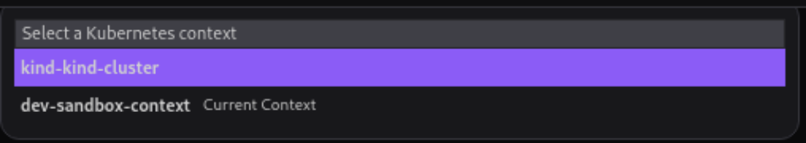
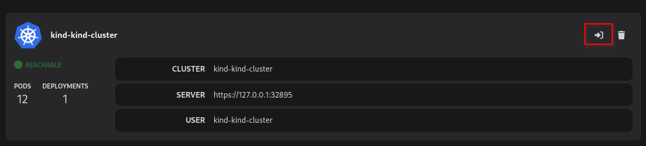
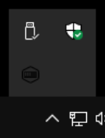
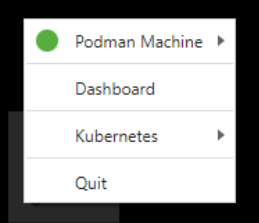
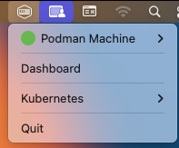
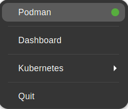
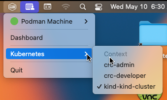

import Tabs from '@theme/Tabs';
import TabItem from '@theme/TabItem';

# Viewing and selecting the current Kubernetes context

With Podman Desktop, you can view and select your current Kubernetes context to access:

- The Kubernetes cluster you want to interact with
- The namespace where you define your application resources

Based on your configurations, Podman Desktop automatically populates the context list. For example, if you have created a Minikube, Kind, or Developer Sandbox cluster, a respective Kubernetes context is automatically added in the Podman Desktop application. Then, you can easily switch from one context to another if needed.

:::note

When you select a Kubernetes context, you can access all the namespaces associated with it. However, you cannot switch from one namespace to another using the Podman Desktop UI. As an alternative, you can use this command: `kubectl config set-context --current --namespace=<name-of-the-namespace>`.

:::

#### Prerequisites

- You have a Kubernetes context in your kubeconfig file: _&lt;your_kubernetes_cluster&gt;_.
  For example, [Creating a kind cluster](/docs/kind/creating-a-kind-cluster).

#### Procedure: Using the status bar

1. To view your current Kubernetes context, in the **Podman Desktop** main window status bar, see the name next to the **Current Kubernetes context** icon.

2. Optional: To change your Kubernetes context:
   1. Click the context in the status bar.
   2. Select a Kubernetes context to activate from the dropdown list.
      

#### Procedure: Using the Podman Desktop Settings

1. Go to **Settings > Kubernetes** to view the configured Kubernetes contexts.
1. Optional: Click the **Set as Current Context** icon to change your context.
   

#### Procedure: Using the tray menu

1. Open the **Podman Desktop tray** menu.

   <Tabs groupId="operating-systems">
   <TabItem value="win" label="Windows">

   In the task bar, click **Show hidden icons**.

   

   Right-click the **Podman Desktop tray** icon to open the menu.

   

   </TabItem>
   <TabItem value="mac" label="macOS">

   

   </TabItem>
   <TabItem value="linux" label="Linux">

   

   </TabItem>

   </Tabs>

1. Click **Kubernetes** to see your current Kubernetes context.

   <Tabs groupId="operating-systems">
   <TabItem value="win" label="Windows">

   

   </TabItem>
   <TabItem value="mac" label="macOS">

   

   </TabItem>
   <TabItem value="linux" label="Linux">

   

   </TabItem>

   </Tabs>

1. (Optionally) To change your Kubernetes context, click on the context name to activate.
