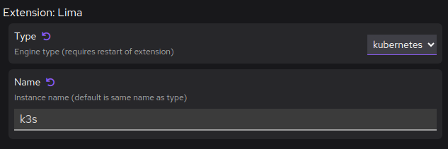

# Creating a Lima instance for Kubernetes workloads with Podman Desktop

To use the Lima provider you need a Lima instance running a Linux machine.

In the future, Podman Desktop might be able to create Lima instances.

Consider creating a custom Lima instance to:

- Control the assigned resources: CPUs, memory, and disk size.
- Control which Kubernetes distribution (`template`) to install.

#### Prerequisites

1. [Install the `lima` CLI](/docs/lima/installing).

#### Procedure

1. In a terminal, create the Lima instance.

   - To create a single-node Kubernetes cluster running [k3s](https://k3s.io/):

     ```shell-session
     $ limactl start template://k3s
     ```

   - To create a single-node Kubernetes cluster running [k8s](https://k8s.io/):

     ```shell-session
     $ limactl start template://k8s
     ```

   - To select the number of CPUs, the memory, and the disk size, add the options to the `limactl start` command:

     ```shell-session
     --cpus=4 --memory=4 --disk=100
     ```

2. Wait for the instance to start, and restart the Lima extension.

   - Go to **<Icon icon="fa-solid fa-cog" size="lg" /> Settings > Preferences > Extension: Lima**, to change the instance name and type.

     - k3s

       - Type: kubernetes
       - Name: k3s
         

     - k8s

       - Type: kubernetes
       - Name: k8s
         

   - Go to **<Icon icon="fa-solid fa-cog" size="lg" /> Settings > Extensions > Lima**, to disable and enable the extension after changes.

#### Verification

1. When the installation is done, the location of the KUBECONFIG file is printed. See [Configuring access to a Kubernetes cluster](/docs/kubernetes/existing-kubernetes).

   - Go to **<Icon icon="fa-solid fa-cog" size="lg" /> Settings > Preferences > Path to the kubeconfig file**, to set the path of the file.

1. Use the `kubectl.lima` wrapper script to connect to the cluster:

   ```shell-session
   $ kubectl.lima version
   ```
