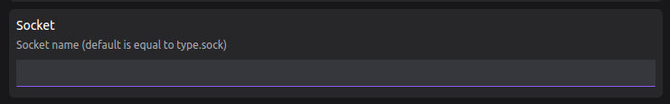

# Creating a Lima instance for container workloads with Podman Desktop

To use the Lima provider you need a Lima instance running a Linux machine.

In the future, Podman Desktop might be able to create Lima instances.

Consider creating a custom Lima instance to:

- Control the assigned resources: CPUs, memory, and disk size.
- Use the rootful connection by default, for example to run Kind.

#### Prerequisites

1. [Install the `lima` CLI](/docs/lima/installing).

#### Procedure

1. In a terminal, create the Lima instance.

   - To create a Lima instance with rootless Podman, use the `podman` template:

     ```shell-session
     $ limactl start --name=podman template://podman
     ```

   - To create a Lima instance with rootful Podman, use the `podman-rootful` template:

     ```shell-session
     $ limactl start --name=podman template://podman-rootful
     ```

   - To create an Lima instance with rootless Docker, use the `docker` template:

     ```shell-session
     $ limactl start --name=docker template://docker
     ```

   - To create an Lima instance with rootful Docker, use the `docker-rootful` template:

     ```shell-session
     $ limactl start --name=docker template://docker-rootful
     ```

   - To select the number of CPUs, the memory, and the disk size, add the options to the `limactl start` command:

     ```shell-session
     --cpus=2 --memory=2 --disk=50
     ```

2. Wait for the instance to start, and restart the Lima extension.

   - Go to **<Icon icon="fa-solid fa-cog" size="lg" /> Settings > Preferences > Extension: Lima**, to change the instance name and type.

     - Podman (default)

       - Type: podman
       - Name: podman
         

     - Docker

       - Type: docker
       - Name: docker
         

   - Go to **<Icon icon="fa-solid fa-cog" size="lg" /> Settings > Preferences > Extension: Lima**, to configure a custom socket name.

     - The default socket name is:

       - `podman.sock` for Podman

       - `docker.sock` for Docker

     - To use a custom socket name:

       

   - Go to **<Icon icon="fa-solid fa-cog" size="lg" /> Settings > Extensions > Lima**, to disable and enable the extension after changes.

#### Verification

- To verify the connection to a running "podman" instance:

  ```shell-session
  $ podman.lima version
  ```

- To verify the connection to a running "docker" instance:

  ```shell-session
  $ docker.lima version
  ```
