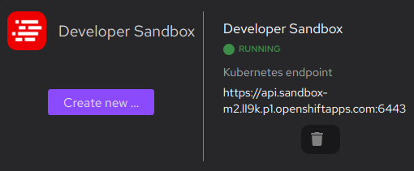

# Configuring access to a Developer Sandbox

The [Developer Sandbox](https://developers.redhat.com/developer-sandbox) is a free, private OpenShift environment including one project and a resource quota of 14 GB RAM, and 40 GB storage.
It lasts 30 days.

With Podman Desktop, you can configure access to your Developer Sandbox instances.

#### Prerequisites

- [Register a Red Hat account](https://developers.redhat.com/register).

#### Procedure

1. Install the _Developer Sandbox_ extension: go to **Dashboard**, and click **Developer Sandbox <Icon icon="fa-solid fa-download" size="lg" />**.
1. Go to **<Icon icon="fa-solid fa-cog" size="lg" /> Settings > Resources**.
1. In the **Developer Sandbox** tile, click **Create new**.
1. In the **Create a Developer Sandbox** screen, click **Log into Developer Sandbox**.
1. In the **Open external website** dialog, click **Yes**.
1. In the [Developer Sandbox website](https://developers.redhat.com/developer-sandbox):
   1. Click **Start your sandbox for free**
   1. If you never used this service, you might get through a verification workflow.
   1. In the **Login with...** screen, click **DevSandbox**.
   1. In your Developer Sandbox Console, click on **your login name > Copy login command** from the menu.
   1. In the **Login with...** screen, click **DevSandbox**.
   1. Click **Display Token**.
   1. Copy the **Log in with this token** full login command, similar to: `oc login --token=sha256~<token> --server=https://api.sandbox-m2.<sandbox_id>.openshiftapps.com:6443`.
1. Get back to Podman Desktop **Create a Developer Sandbox** screen.
   1. **Context name**: Enter a name such as `Developer Sandbox`.
   2. **Login command**: Paste the `oc login` command that you copied previously.
1. The **Creation** screen displays _Successful operation_. Click **Go back to Resources**.

#### Verification

1. On the **<Icon icon="fa-solid fa-cog" size="lg" /> Settings > Resources** screen, your Developer Sandbox is running.

   

1. [Select your Developer Sandbox in the Podman Desktop tray](/docs/kubernetes/viewing-and-selecting-current-kubernetes-context)
1. Run basic tasks such as:
   - [Deploying a container](/docs/kubernetes/deploying-a-container-to-kubernetes)
   - [Deploying a pod](/docs/kubernetes/deploying-a-pod-to-kubernetes)
