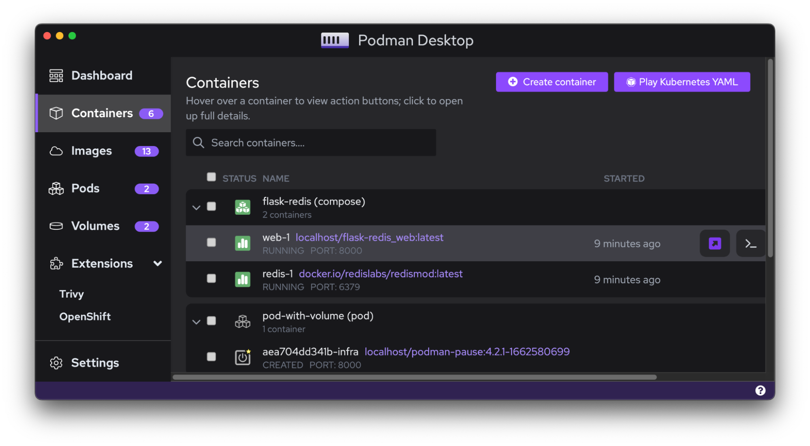

## Introduction

Podman Desktop is aimed at providing an amazing graphical experience of managing your containers. Developers who have worked on containers might be fans of the [Compose Spec](https://compose-spec.io/).

[Podman Compose](https://github.com/containers/podman-compose#readme) is a community-driven tool that allows developers to run multiple containers at the same time and facilitate communication between them. Podman Compose requires a [Compose YAML](https://compose-spec.io/) file with definitions about the containers that need to communicate.

If you are new to writing [Compose files](https://github.com/compose-spec/compose-spec/blob/master/spec.md#compose-file) or [Compose Spec](https://compose-spec.io/), check out [this guide](https://github.com/compose-spec/compose-spec/blob/master/spec.md) for more information. 

## Requirements

### 1. Podman Desktop
Get the latest version of Podman Desktop by clicking [here](/downloads). Refer to the [installation guide](/docs/installation) for more information.
### 2. Podman Compose

## Get Started

In this tutorial, we will learn about working with containers on Podman Desktop generated using `podman-compose`. You can find more information about Podman Compose [here](https://github.com/containers/podman-compose/blob/devel/README.md). 

### 1. Install Podman Compose
#### For macOS

There are many ways to install `podman-compose` on your macOS system. One of the easier ways is to use Homebrew. To install `podman-compose`, run the following command

```sh
brew install podman-compose
```

To ensure `podman-compose` is properly installed, run the command: 
```sh
podman-compose
``` 
and it will return more information about its usage.

#### For Windows and Linux

Refer the official [installation guide](https://github.com/containers/podman-compose#installation) to get the latest version of Podman Compose on your Windows or Linux system. 

### 2. Using Podman Compose to run multiple containers

For this tutorial, we will use the [Flask Redis project](https://github.com/docker/awesome-compose/tree/master/flask-redis) from the [awesome-compose repository](https://github.com/docker/awesome-compose). This repository consists of many sample projects for you to get started with Podman Compose. 
1. Open your Terminal window
2. Change to the project directory 
```sh
cd flask-redis
```
3. Run the following command 
```sh
podman-compose -f compose.yaml up -d
```
The `compose.yaml` file contains definitions for multiple containers within the `flask-redis` project.


### 3. Manage Compose with Podman Desktop

To check if the containers are running as expected, open Podman Desktop and click on the ‘Containers’ option on the left side of the application. You will notice that the containers are bundled together under a Pod named `flask-redis (compose)` in this case. Here, the compose within the bracket indicates that it is generated from a Compose YAML file. 



You can further configure or work with these containers within the Podman Desktop application now that they are visible. Here, clicking on the ‘Open Browser’ button allows us to check if the application is running as expected. 


You can do much more such as checking logs, opening the terminal or inspecting the files for more details.


## Conclusion

That is it. This is how you can use Podman Desktop for your containers generated through `podman-compose`. It will be really exciting to see you all developers use these compatibilities to build exciting applications using Podman Desktop!

