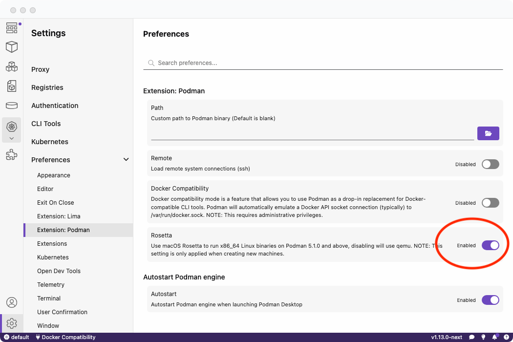

# Native Apple Rosetta translation layer

On macOS, Podman machine creates a virtual machine that uses the native Apple hypervisor `applehv` with Rosetta enabled by default. This increases the speed of any `x86_64` builds or containers to near-native levels by using a translation layer.

Rosetta support is enabled by default on all new Podman machine installations. If you disable Rosetta, [qemu](https://www.qemu.org/) will instead be used.

#### Prerequisites

- macOS Silicon

#### Procedure

To enable Rosetta support, re-create your Podman machine instance:

1. Delete your Podman machine.

2. Enable Rosetta support under **Settings**:

3. Re-create your Podman machine.

#### Verification

To verify that Rosetta has been enabled or disabled, check your `~/.config/containers/containers.conf` configuration.

You will see the `rosetta` configuration parameter with either `true` or `false`. If the parameter does _not_ exist, Rosetta is already enabled by default.

#### Additional resources

- [Official Apple Rosetta documentation](https://developer.apple.com/documentation/virtualization/running_intel_binaries_in_linux_vms_with_rosetta)
