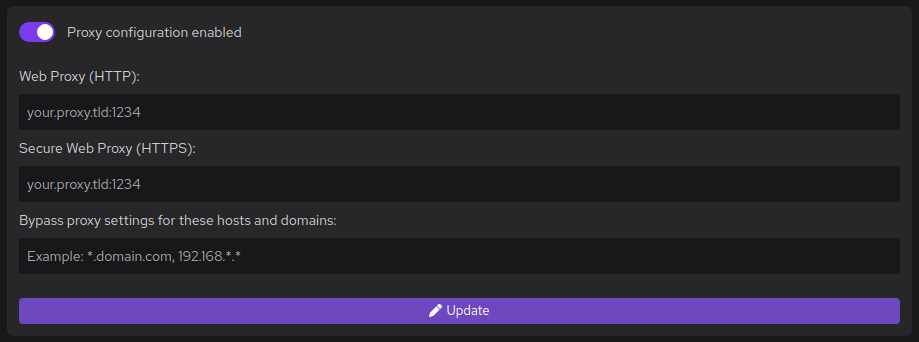

#### Procedure

1. Go to **Settings > Proxy**, set your proxy URL, and validate.

   

<details>
<summary>
2. (Optionally) If your containers require access to the restricted network, set up the proxy for your containers.
</summary>

1. Open a shell prompt on the Podman machine:

   ```shell-session
   $ podman machine ssh
   ```

1. Edit the `containers.conf` file to pass the proxy environment variables to Podman CLI.

   The file location depends on your connection mode:

   - `rootless`: `$HOME/.config/containers/containers.conf`

   - `rootful`: `/etc/containers/containers.conf`

1. Set the proxy environment variables to pass into the containers:

   ```toml
   [containers]
   http_proxy = true
   env = ["http_proxy=<your.proxy.tld:port>", "https_proxy=<your.proxy.tld:port>"]
   ```

1. Go to **Settings > Resources** and restart the Podman machine.

</details>

<details>
<summary>
3. (Optionally) If your proxy has a custom Certificate Authorities (CA), such as a self-signed certificate, set up the proxy custom CA.
</summary>

1. Store your proxy Certificate Authorities (CA) in your home directory, in the `proxy_ca.pem` file, in Privacy-Enhanced Mail (PEM) format.

1. Copy the certificate to the Podman machine:

   ```shell-session
   $ cat proxy_ca.pem | podman machine ssh podman-machine-default "cat > proxy_ca.pem"
   ```

1. Open a shell prompt on the Podman machine:

   ```shell-session
   $ podman machine ssh
   ```

1. Add the custom Certificate Authorities (CA) for your proxy:

   ```shell-session
   $ sudo cp proxy_ca.pem /etc/pki/ca-trust/source/anchors/
   $ sudo update-ca-trust
   ```

</details>

4. Go to **Settings > Resources** and restart the Podman machine.

#### Verification

- The configuration applies to processes that Podman Desktop started. You can:

  - Install extensions.
  - [Install Podman](/docs/onboarding-for-containers/installing-podman).
  - [Install Compose](/docs/compose/setting-up-compose).
  - [Install Kind](/docs/onboarding-for-kubernetes/kind/installing-kind).

- The configuration applies to Podman. You can:

  - [Pull an image](/docs/working-with-containers/images/pulling-an-image).

- The configuration does not apply to command line tools that Podman Desktop did not start.
