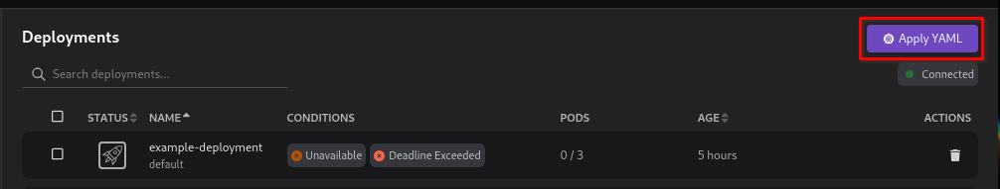
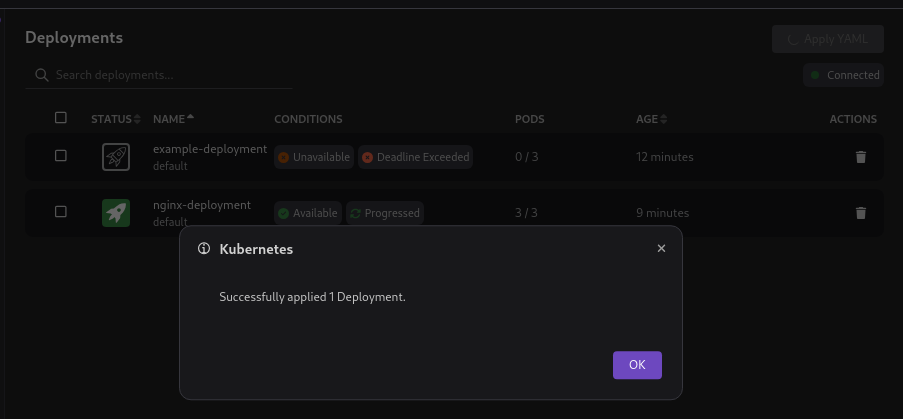
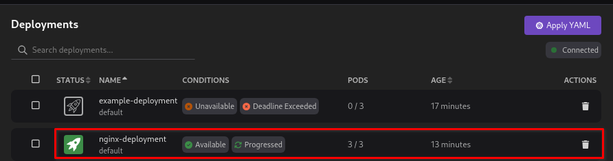
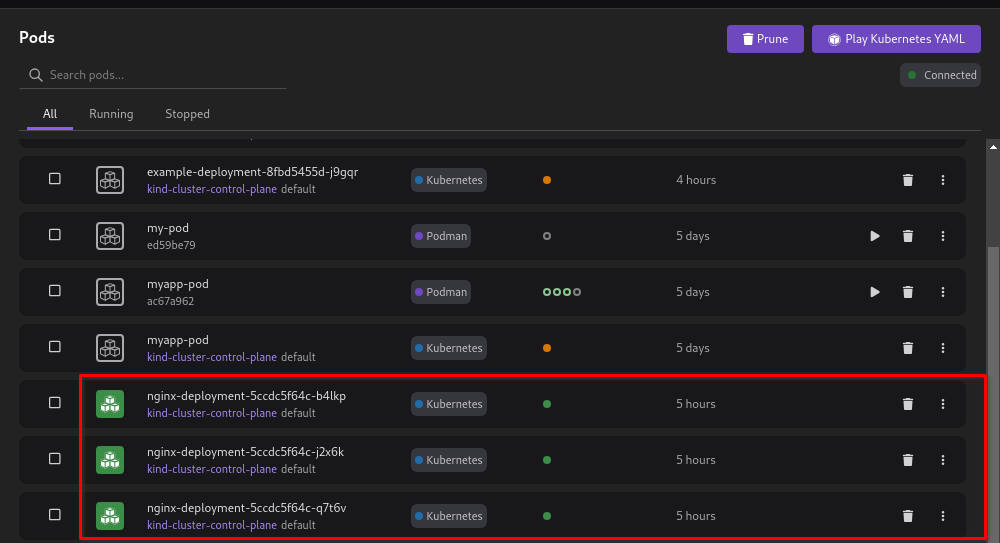
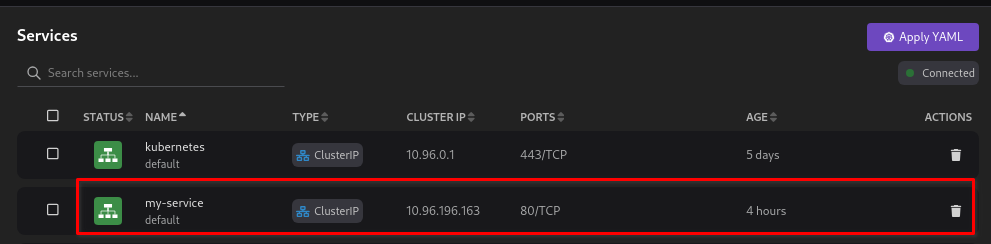
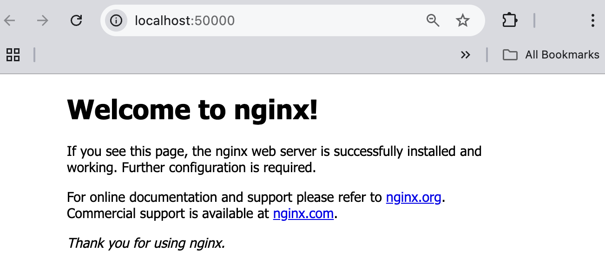

# Deploying a Kubernetes application

This tutorial covers the following end-to-end tasks required to deploy an application in a Kubernetes cluster:

- Set the Kubernetes context
- Creating a deployment
- Creating a service
- Verifying the service: port forwarding

If you have multiple Kubernetes contexts, you must set the correct context in which you want to create your application resources. Within a Kubernetes cluster, you can access the application by its internal IP address. However, if you want to make your application accessible from an outside network, you must expose the pod containing your application as a Kubernetes service.
To access the service running on your Kubernetes cluster, you can use one of the following options:

- Port forwarding with CLI (covered in this tutorial)
- [Create an ingress controller with UI](/docs/kind/building-an-image-and-testing-it-in-kind)

## Before you begin

Make sure you have:

- [Installed Podman Desktop](/docs/installation).
- [A running Podman machine](/docs/podman/creating-a-podman-machine).
- [A running Kubernetes cluster](/docs/kind/creating-a-kind-cluster).
- A developer role.
- Created a `Deployment` file using the following code, if you do not have one on your machine:

```yaml
apiVersion: apps/v1
kind: Deployment
metadata:
  name: my-nginx
spec:
  selector:
    matchLabels:
      run: my-nginx
  replicas: 2
  template:
    metadata:
      labels:
        run: my-nginx
    spec:
      containers:
        - name: my-nginx
          image: nginx
          ports:
            - containerPort: 80
```

This YAML configuration creates a `my-nginx` deployment running two Nginx pods.

- Created a `Service` file using the following code, if you do not have one on your machine:

```yaml
apiVersion: v1
kind: Service
metadata:
  name: my-nginx
  labels:
    run: my-nginx
spec:
  ports:
    - port: 80
      protocol: TCP
      targetPort: 80
  selector:
    run: my-nginx
```

This YAML configuration creates a service named `my-nginx` to expose the Nginx deployment outside the Kubernetes cluster. The service listens client requests on port `80` and then forwards them to a target port `80` on the container.

## Setting the Kubernetes context

1. Go to **Settings > Kubernetes**.
2. Set the current Kubernetes context. For example, if you want to use a Kind cluster, use the **Set as Current Context** icon in the UI:
   

## Creating a deployment

1. Go to Kubernetes explorer from the left navigation pane.
2. Go to **Deployments** and Click **Apply YAML**.
   
3. Select the YAML configuration file and click **Open**. A successful operation notification opens.
   
4. Click **OK**.
5. View the newly created `my-nginx` deployment on the same page.
   
6. Restart the Podman Desktop application.
7. Go to **Pods** from the left navigation pane.
8. View the two newly created `my-nginx` pods.
   

## Creating a service

1. In the Kubernetes explorer, go to **Services**.
2. Click **Apply YAML**.
3. Select the YAML configuration file and click **Open**. A successful operation notification opens.
4. Click **OK**.
5. View the newly created service on the same page.
   

## Verifying the service: port forwarding

1. Use the `kubectl port-forward` command to forward a local port to the service. The following example uses the local port `20000`.

```sh
$ kubectl port-forward service/my-nginx 20000:80
```

2. Open a web browser.
3. Enter the local host address, for example, _http://localhost:20000_.
4. View the Nginx welcome page.
   
