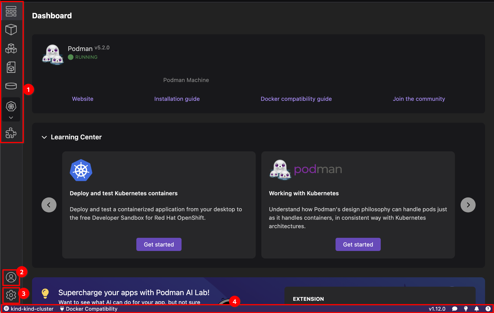

# Introduction

These tutorials cover end-to-end tasks that you must perform to accomplish a goal while working with the Podman Desktop application. Each task is a procedure that contains a sequence of steps to follow.

Before going through each tutorial, familiarize yourself with the key UI components of the Podman Desktop application:

1. **Left navigation pane**: Helps in accessing the dashboard and managing containers, images, pods, volumes, Kubernetes resources, and extensions. You can apply different actions from each component page.

   :::note

   The Kubernetes explorer component appears in the navigation pane only if you have set up a Kubernetes cluster.

   :::

2. **Accounts**: Provides easy access to the **Authentication** settings. You can add an authentication provider using the **Red Hat Authentication** extension.
3. **Settings**: Helps you to:

   - Create resources for your development environment
   - Configure proxy URLs
   - Configure a registry for secure storage and distribution of containers and cloud-native artifacts
   - Configure an authentication provider
   - Configure a CLI tool
   - Configure a Kubernetes context
   - Configure the application appearance, extensions, the terminal size and line height, and the telemetry feature.

4. **Status bar**: Provides the following capabilities:
   - Configure a Docker-compatible environment
   - Set your kubernetes context
   - Share your feedback
   - Troubleshoot your container connections and view logs
   - View notifications and additional help resources

## List of tutorials

- [Running a pod using a container or docker file](/tutorial/running-a-pod-using-a-container-docker-file)
- [Running a Kubernetes cluster](/tutorial/running-a-kubernetes-cluster)
- [Deploying a Kubernetes application](/tutorial/deploying-a-kubernetes-application)
- [Managing your application resources](/tutorial/managing-your-application-resources)
- [Running an AI application](/tutorial/running-an-ai-application)
