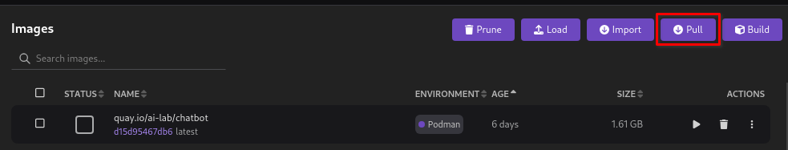
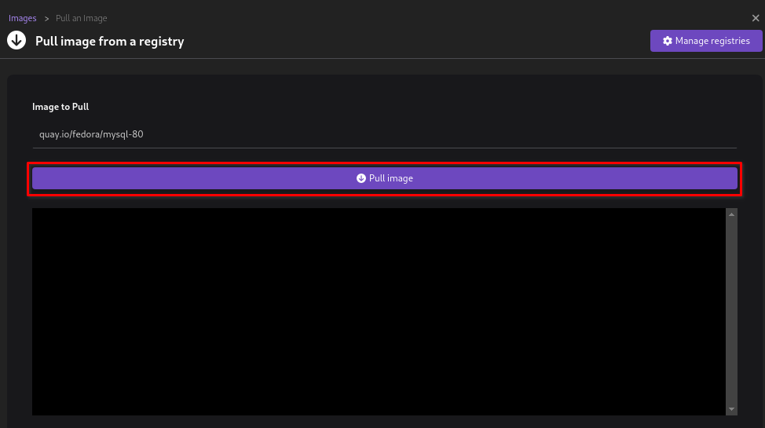
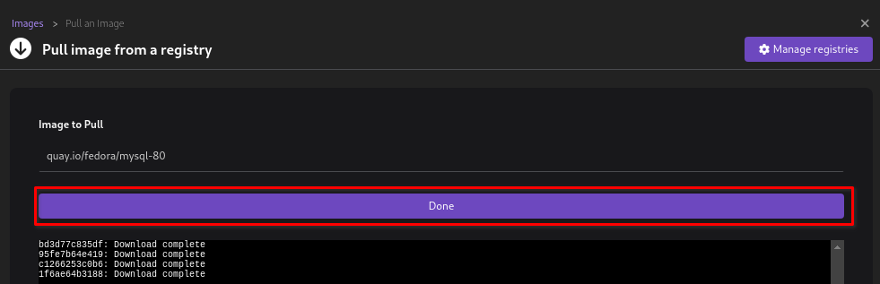
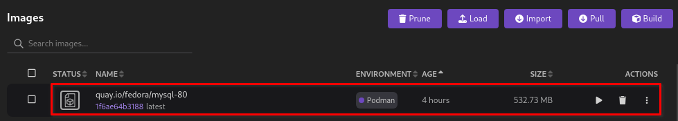
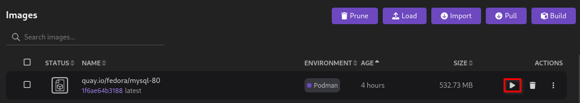
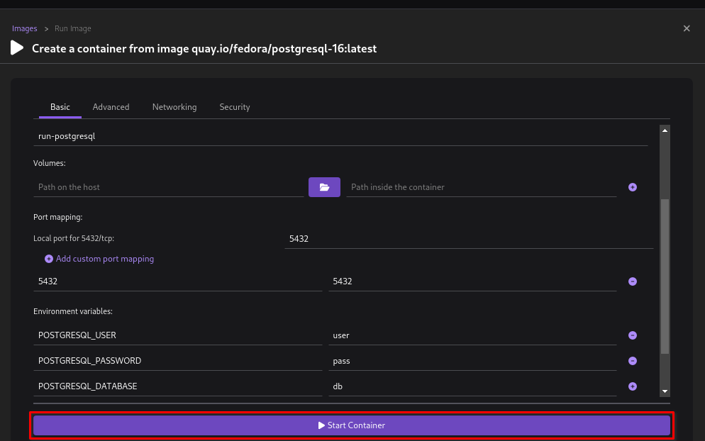
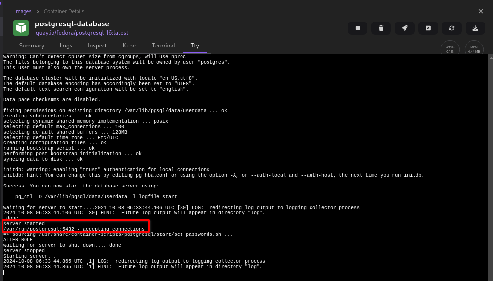
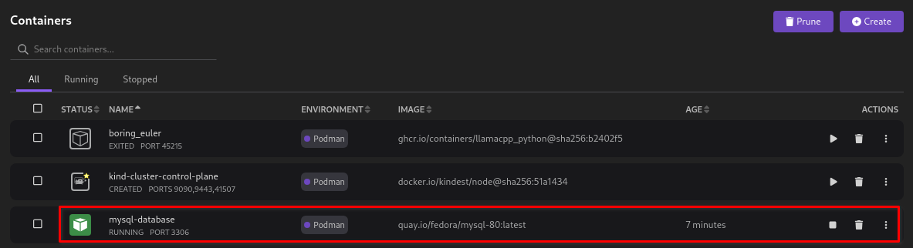
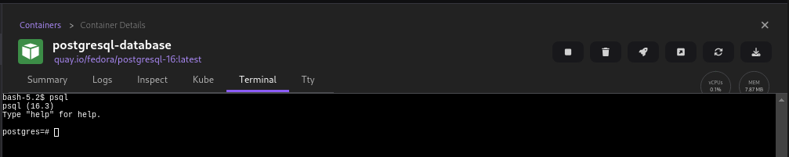
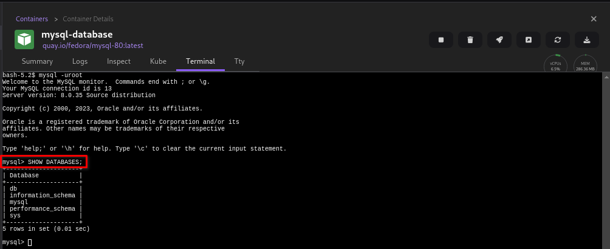

# Interacting with a database server

This tutorial covers the following end-to-end tasks required to interact with a database server from within the Podman Desktop UI:

- Pulling a database server image
- Creating a database server instance
- Accessing the instance from terminal

For creating a database instance, you can use one of the following options:

- [Build a database server image using a container or docker file](/docs/containers/images/building-an-image)
- [Import a database server image from your local machine](/tutorial/managing-your-application-resources#managing-images) using the **Import** button on the _Images_ component page
- Pull a database server image from a registry (covered in this tutorial)

This tutorial focuses on creating a PostgreSQL server instance by pulling the `quay.io/fedora/postgresql-16` image from the _quay.io_ registry.

## Before you begin

Make sure you have:

- [Installed Podman Desktop](/docs/installation).
- [A running Podman machine](/docs/podman/creating-a-podman-machine).
- A developer role.

## Pulling a PostgreSQL server image

1. Click **Images** in the left navigation pane.
1. Click the **Pull** button.
   
1. Enter the name of the image to pull from the registry.
1. Click **Pull image**. A download complete notification opens.
   
1. Click **Done**.
   
1. View the newly created `quay.io/fedora/postgresql-16` image on the same page.
   

## Creating a PostgreSQL server instance

1. Click **Images** in the left navigation pane.
1. Click the **Run Image** icon corresponding to the PostgreSQL server image you want to run.
   
1. Configure the basic details, such as container name, port mapping, and environment variables for the PostgreSQL server instance.
1. Click **Start Container**.
   
1. View the successful operation notification in the _Tty_ tab of the _Container Details_ page.
   
1. Click the **close** icon on the right hand side of the page.
1. Click **Containers** in the left navigation pane.
1. View the newly created PostgreSQL server container on the page.
   

## Accessing the instance from terminal

1. Click **Containers** in the left navigation pane.
1. Click the created `postgresql-database` container. The _Container Details_ page opens.
   

1. Select the **Terminal** tab.
1. Run the `psql` command to connect to the database server. The prompt changes to `postgres=#`.
   
1. Interact with the database server by running any PostgreSQL commands, such as `\list`:
   

:::note

To access this database server instance from inside a running application container, use the `podman exec -it postgresql-database /bin/bash` command.

:::
