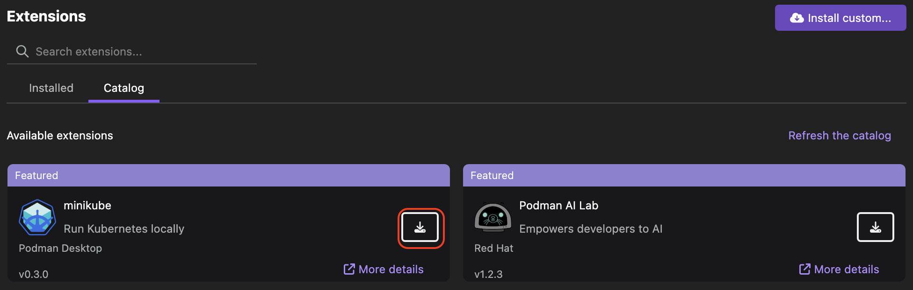
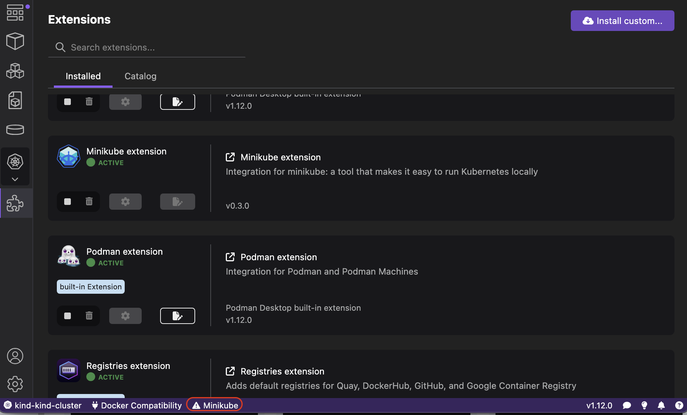
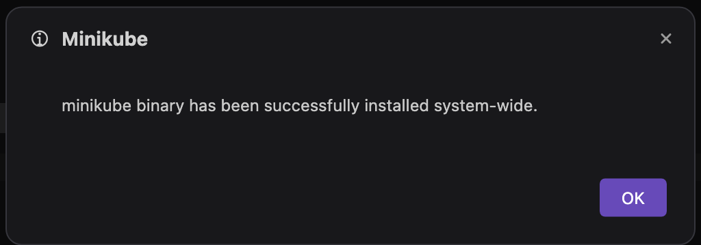
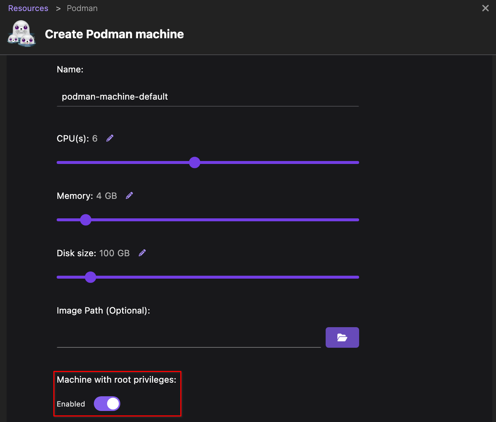
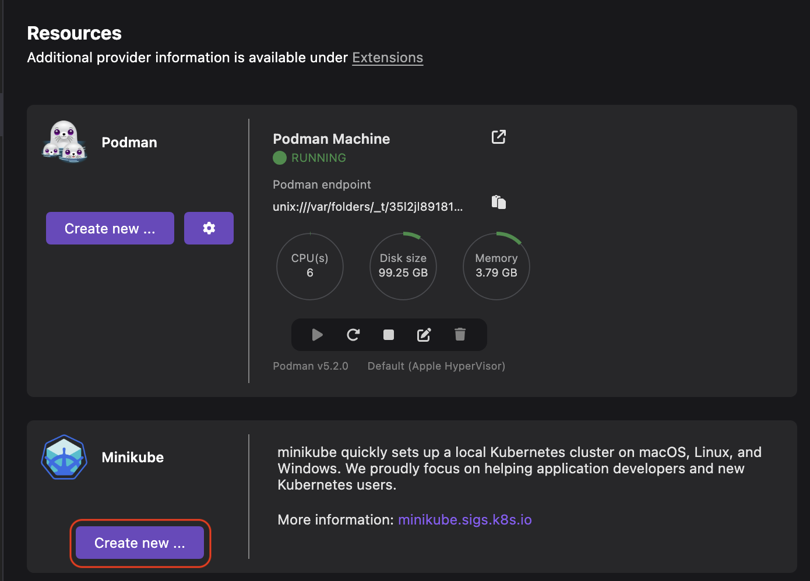
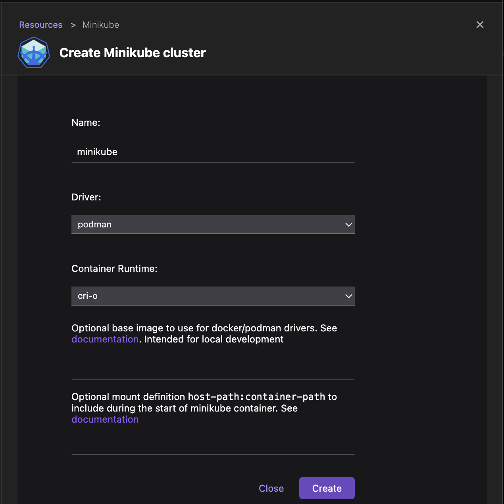
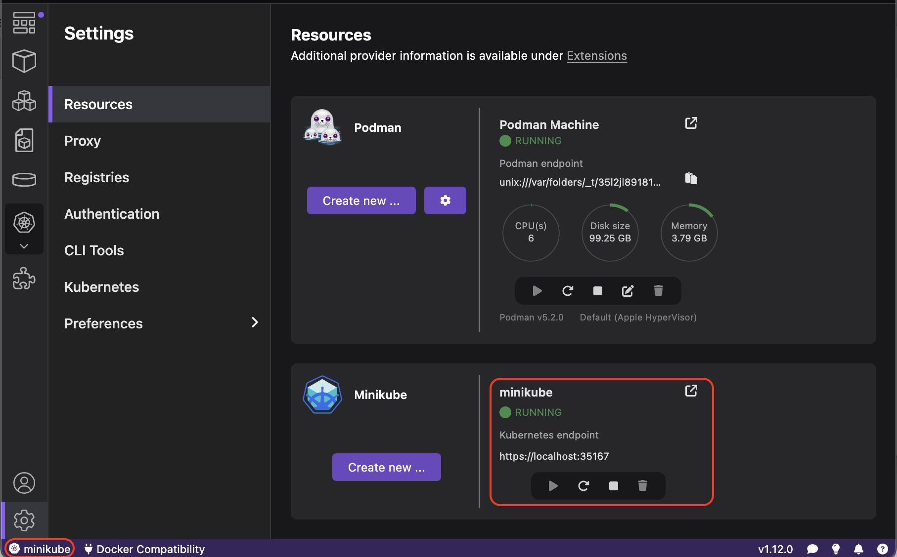

# Running a Kubernetes cluster

This tutorial covers the following end-to-end tasks required to run a Kubernetes cluster with the help of an extension:

- Installing the extension
- Installing CLI on your local machine
- Applicable on Windows: Configure Podman on WSL
- Creating and running a Kubernetes cluster

You can use extensions, such as Kind and Minikube to start a local Kubernetes development cluster. When you have a running Kubernetes cluster, you can easily develop and test Kubernetes applications before deploying them to production. This tutorial focuses on creating a Kubernetes cluster using the Minikube extension.

## Before you begin

Make sure you have:

- [Installed Podman Desktop](/docs/installation).
- [A running Podman machine](/docs/podman/creating-a-podman-machine).
- A developer role.

## Installing the extension

1. Go to **Extensions > Catalog**.
2. Find the Minikube extension using the search box.
3. Click the **Install** icon.
   

4. Select the **Installed** tab to check the Minikube extension is active.
   

## Installing CLI on your local machine

1. Click the **Minikube not found on your system** icon in the status bar.
   

2. Click **Yes** to download the Minikube binary.
3. Click **Yes** to install the binary system-wide for accessibility on the command line.
4. Enter your system password, if prompted. A notification of successful operation opens.
   

5. Click **OK**.
6. Check the **Minikube not found on your system** icon disappears from the status bar.

## Applicable on Windows: Configure Podman on WSL

To use the Minikube tool on Windows, you must have a Podman machine running in rootful mode.

- By default, the Podman Desktop **Settings** enable you to create a Podman machine that runs in rootful mode.

  

## Creating and running a Kubernetes cluster

1. Go to **Settings > Resources**.
2. In the Minikube tile, click **Create new**.
   

3. Optional: Edit the cluster configuration, if required.
   
4. Click **Create**. A notification of successful operation opens.
5. Click **Go back to resources**.
6. View that your Minikube cluster is running and a new minikube context is added in the status bar.
   

## Additional resources

- [Working with a Kind cluster](/docs/kind)
- [Working with a Minikube cluster](/docs/minikube)
- [Working with a Lima cluster](/docs/lima)
