# Running an AI application

This tutorial covers the following end-to-end tasks required to run and verify an Artificial Intelligence (AI) application on your local machine:

- Installing the extension
- Downloading a model
- Creating a service
- Optional: Creating a playground
- Running a recipe
- Verifying the AI application

Before going through this tutorial, familiarize yourself with the usage of the following sections on the AI Lab page:

1. **Catalog**: Helps in downloading or importing a model.
2. **Services**: Helps in creating an inference server that runs in a container to serve a large language model (LLM) using an OpenAI-compatible API. After creating a service, you can access its details and generate its client code in any programming languages to integrate your application.
3. **Playgrounds**: Helps in experimenting with model parameters and accuracy to identify the best model and parameters for your use case. Each playground denotes a customized environment to experiment with a model.
4. **Recipes Catalog**: Helps in accessing a catalog of recipes, such as ChatBot, audio-to-text, code generation, and summarizer. Each recipe denotes an AI application catering to a specific use case. You can use a recipe to start an AI application. You can also clone a recipe to your local machine for editing purposes.
5. **Running**: Helps in accessing all running AI applications.

This tutorial focuses on running a ChatBot AI application.

## Before you begin

Make sure you have:

- [Installed Podman Desktop](/docs/installation).
- [A running Podman machine](/docs/podman/creating-a-podman-machine) with at least 6 GB memory. If the Podman machine does not have enough memory, you get a notification to update its memory configuration while downloading a model or running a recipe:
  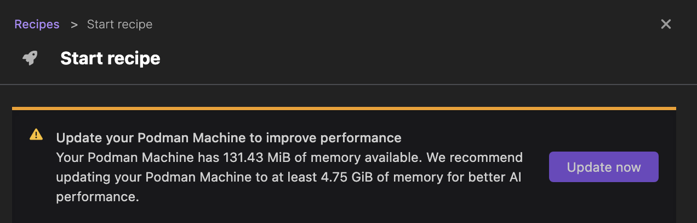
- A developer role.

## Installing the extension

1. Go to **Extensions > Catalog**.
2. Find the Podman AI Lab extension using the search box.
3. Click the **Install** icon to install the extension.
   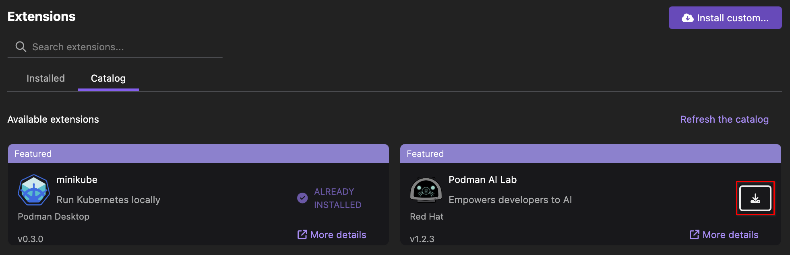
4. Select the **Installed** tab to check the extension is active, and check that a new AI Lab component is added in the left navigation pane.
   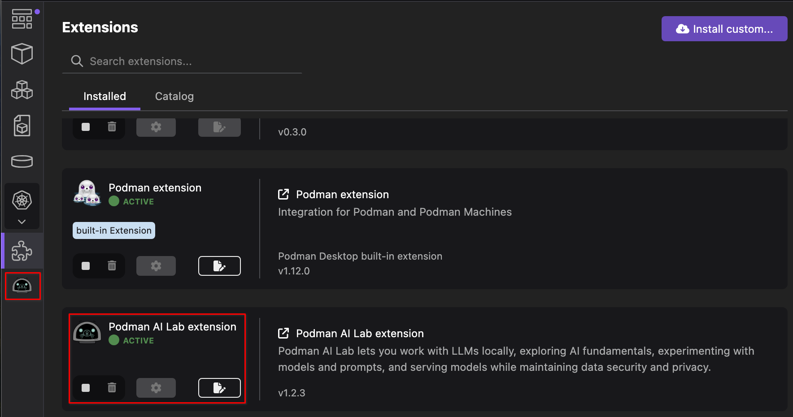

## Downloading a model

1. Click **AI Lab** in the left navigation pane.
2. In the Catalog section, click the **Download** icon corresponding to the model you want to use.
   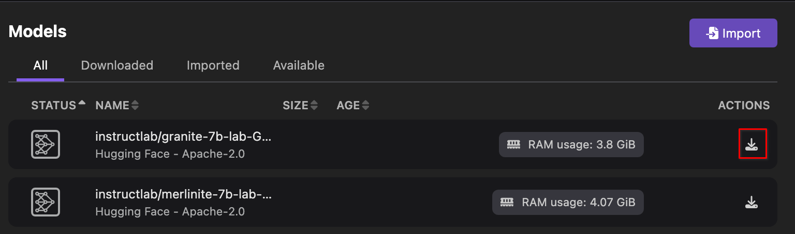

3. View the downloaded model on the same page after the download completes.
   

## Creating a service

1. Click **AI Lab** in the left navigation pane.
2. In the Services section, click **New Model Service**.
   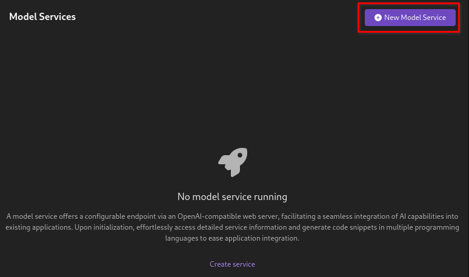

3. Select the model from the dropdown list.
4. Optional: Edit the port number of the container that is created for the service.
5. Click **Create service**.
   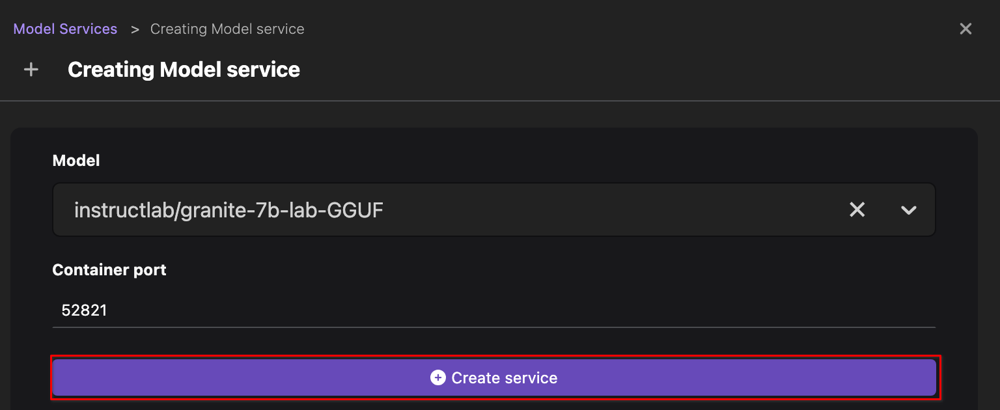

6. Click **Open service details**.
   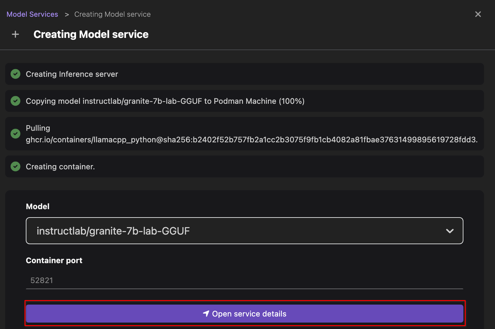

7. View the service details, such as model name, server address, and client code.
   

   :::note

   By default, you view the client code in the cURL programming language. You can customize the client code based on your needs.

   :::

8. Optional: In the Client code section, select the programming language or framework from the dropdown list to view the updated code.
9. Click the **Close** icon on the right side of the page.
10. View the newly created service on the same page.
    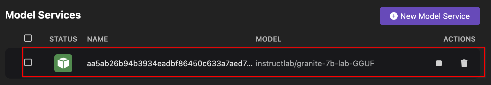

11. Optional: View the service container by opening the **Containers** page from the left navigation pane.
    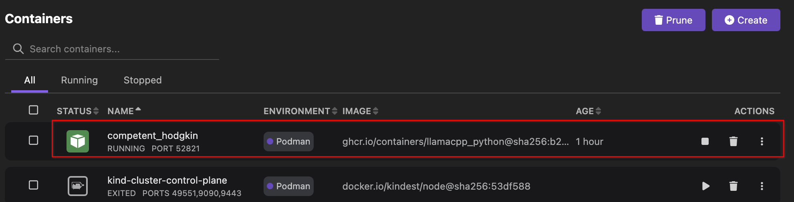

## Optional: Creating a playground

Perform this task only if you want to experiment with the model before using it to start your AI application.

1. Click **AI Lab** in the left navigation pane.
2. In the Playgrounds section, click **New Playground**.
   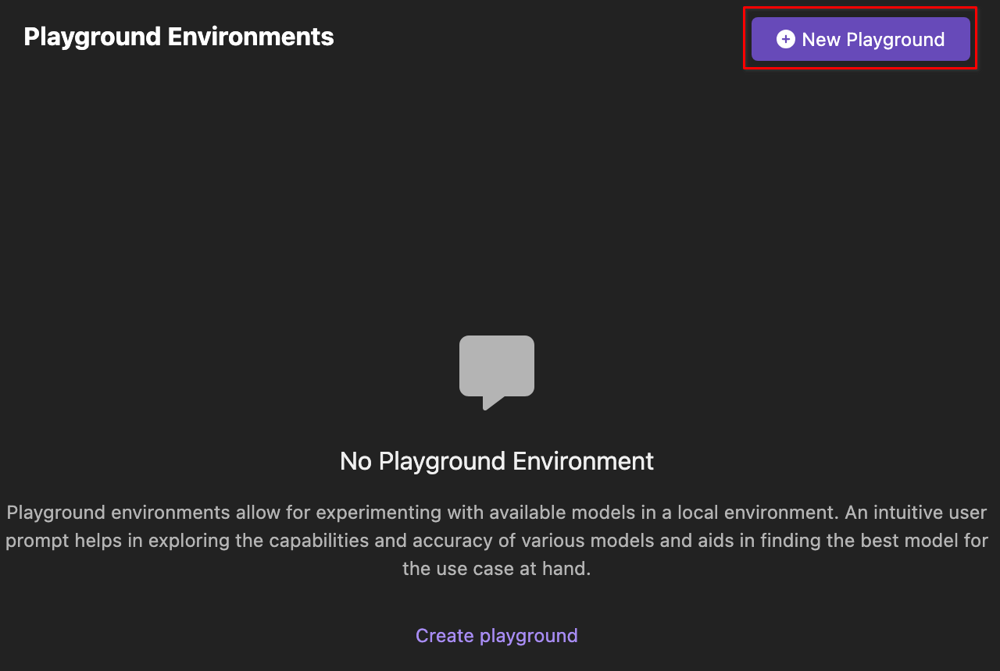

3. Optional: Enter the name of the playground.
4. Select a model from the dropdown list.
5. Click **Create playground**.
   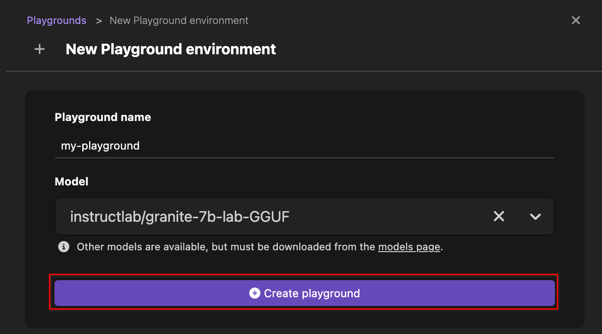

6. View the newly created playground on the same page.
   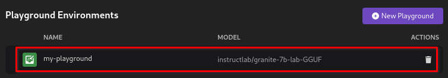

7. Click the name of the playground to edit the model settings for experiment:

   1. Edit the value of the model parameters.
      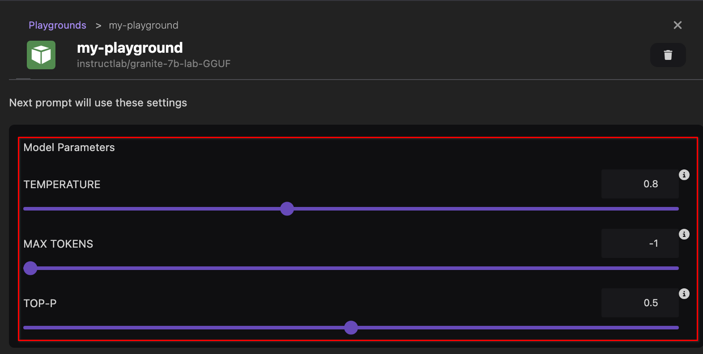

   2. Click the **Edit system prompt** icon to add a system prompt and save it.
      

   3. Enter your question in the prompt box and analyze the accuracy of the answer.
      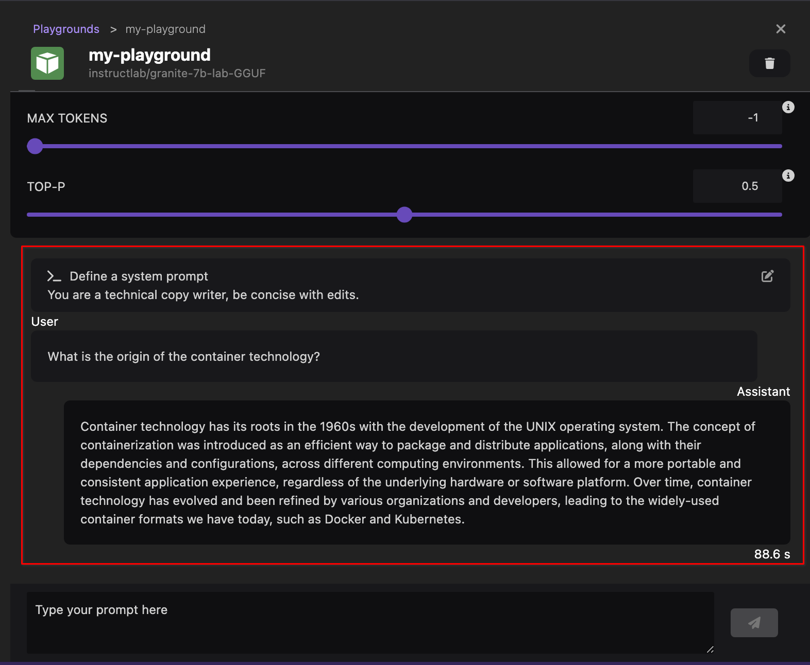

## Running a recipe: ChatBot AI application

1. Click **AI Lab** in the left navigation pane.
2. In the Recipes Catalog section, click **More details** in the ChatBot recipe tile. The recipe summary page opens.
   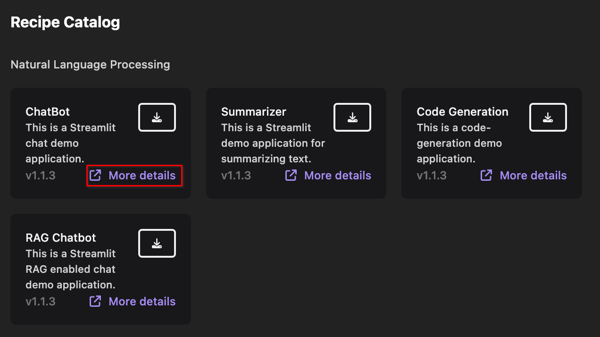

3. Click **Start**. The Start recipe page opens.
   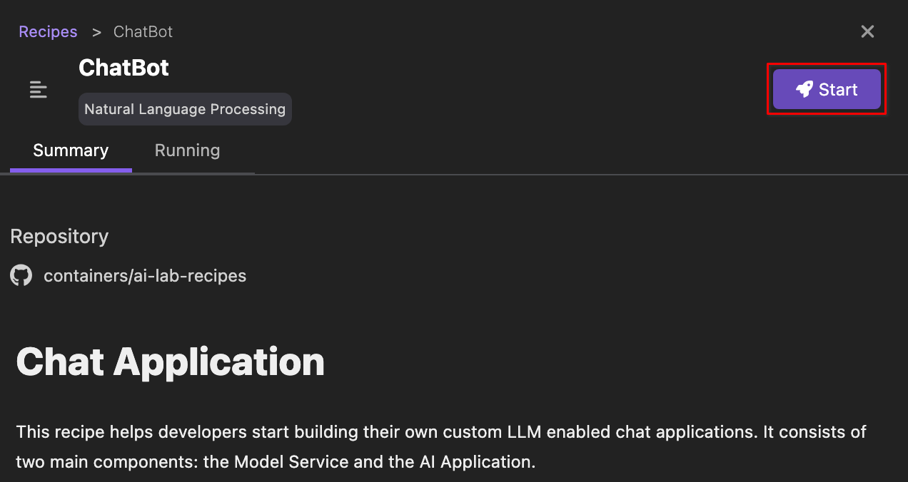

4. Select a model from the dropdown list.

   :::note

   The models listed with a star are recommended to use with the recipe.

   :::

5. Click **Start ChatBot recipe**. This step might take some time to pull the recipe, copy the model to your Podman machine, start the inference server, load configurations, and create the application.
   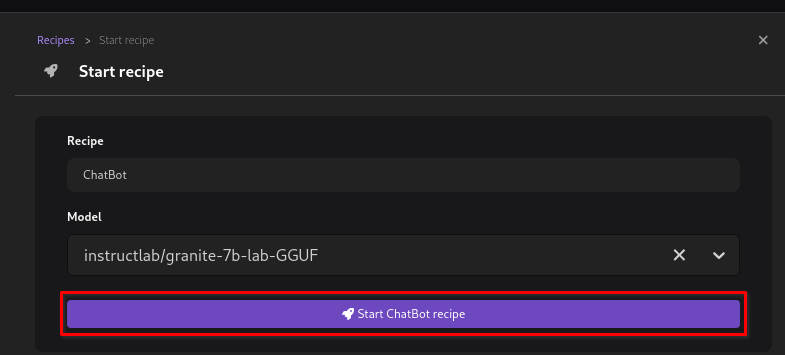

6. Click **Open details** after the processing completes.
   

7. View the running AI application in the Running tab.
   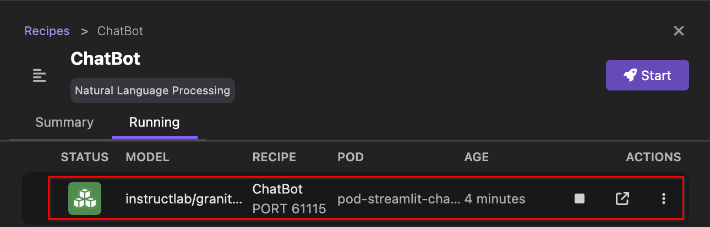

8. Optional: View the running AI application pod by opening the **Pods** page from the left navigation pane.
   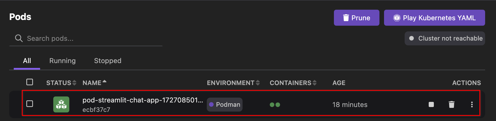

## Verifying the AI application

1. Go to **AI Lab > Running** using the left navigation pane.
2. Click the **Open AI App** icon to open the ChatBot application locally in a browser.
   

3. Enter your question in the chat box and analyze the accuracy of the answer.
   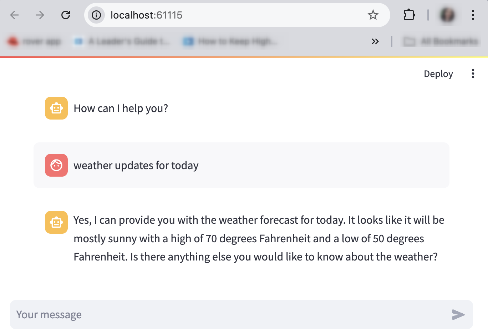
